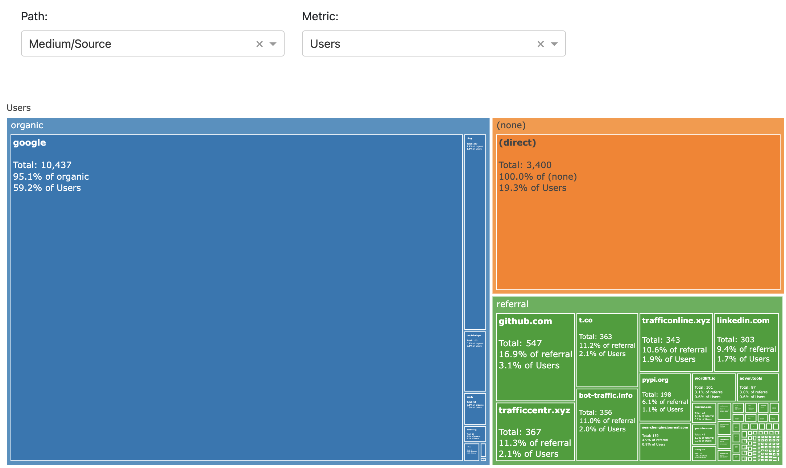

# Multilevel Interactive Treemap

A simple Plotly Dash interactive app allowing the user to select the levels (dimensions) across which to group and count the selected metric.

The starting point is a table in this format:

level_1 | level_2 | metric1 | metric2 | metric3
--------|---------|---------|---------|--------
A       | A1      |234      |3543     |687
A       | A2      |2345     |345      |465
B       | B1      |354      |465      |567
B       | B2      |324      |345      |567
C       | C1      |345      |465      |453
C       | C2      |456      |456      |678

Two dropdowns allow the user to 
1. Select which dimensions and in which order they would like to group (`level_1` and `level_2` in this case).
2. Select a single metric to size the rectangles by

As an example a report from Google Analytics can be shown: 

|    | Medium   | Source           |   Users |   New Users |   Sessions | Bounce Rate   |
|---:|:---------|:-----------------|--------:|------------:|-----------:|:--------------|
|  0 | organic  | google           |   10437 |       10168 |      13215 | 69.48%        |
|  1 | (none)   | (direct)         |    3400 |        3406 |       4190 | 60.95%        |
|  2 | referral | github.com       |     547 |         412 |        806 | 49.63%        |
|  3 | referral | trafficcentr.xyz |     367 |         303 |        400 | 0.00%         |
|  4 | referral | t.co             |     363 |         348 |        405 | 62.47%        |

allowing the user to select as follows:

Check it out here:

